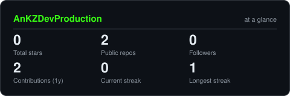
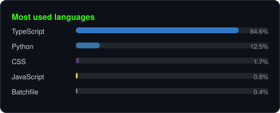
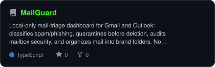

<!-- NAME / TAGLINE - animated typing -->

 

---

## This is me :)

Dev full-stack, focus sur des outils locaux et privacy-first — des applis qui tournent chez l'utilisateur, sans envoyer ses données ailleurs.

- 🛡️ Je construis des outils **local-first** : pas de cloud tiers, pas de traitement de données par des services externes.
- 🔐 Attentif à la **sécurité** dès la conception — OAuth, chiffrement au repos, audit de configuration.
- 🧱 Stack principale : **Next.js / TypeScript / Prisma / Tailwind**.

 

## my stack

---

## signals

<table>
<tr>
<td width="50%" align="center" valign="middle">

<!-- Self-rated radar - edit assets/skills.json, the workflow redraws it -->
<picture>
  <source media="(prefers-color-scheme: dark)"  srcset="assets/radar-dark.svg">
  <source media="(prefers-color-scheme: light)" srcset="assets/radar-light.svg">
  
</picture>

</td>
<td width="50%" align="center" valign="middle">

<!-- Hand-authored language & stack radar - edit assets/langmix.json -->
<picture>
  <source media="(prefers-color-scheme: dark)"  srcset="assets/radar-langs-dark.svg">
  <source media="(prefers-color-scheme: light)" srcset="assets/radar-langs-light.svg">
  
</picture>

</td>
</tr>
</table>

---

## numbers

<!-- Generated by scripts/cards.py into this repo. Deliberately NOT
     github-readme-stats / streak-stats / github-profile-trophy: those are
     shared public instances that go down and take the whole section with them. -->
<picture>
  <source media="(prefers-color-scheme: dark)"  srcset="assets/card-stats-dark.svg">
  <source media="(prefers-color-scheme: light)" srcset="assets/card-stats-light.svg">
  
</picture>

 

---

## featured project

<!-- Generated by scripts/cards.py from assets/projects.json -->
<picture>
  <source media="(prefers-color-scheme: dark)"  srcset="assets/card-MailGuard-dark.svg">
  <source media="(prefers-color-scheme: light)" srcset="assets/card-MailGuard-light.svg">
  
</picture>

